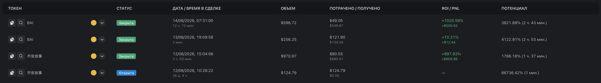
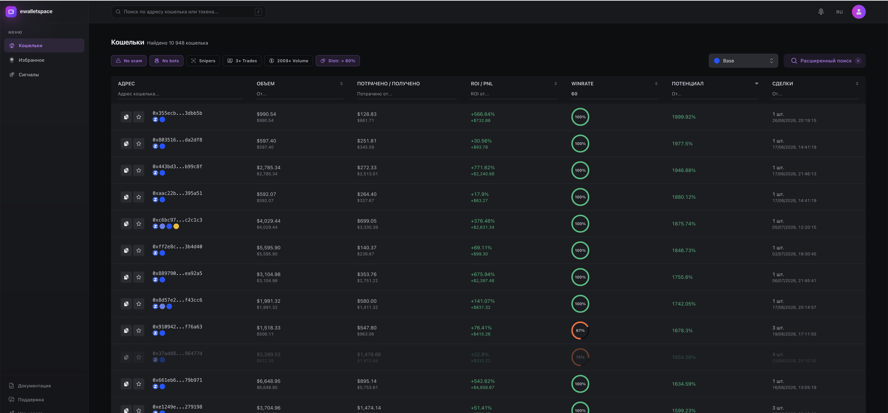

# Что такое eWalletSpace

**eWalletSpace** - это платформа для поиска и анализа ончейн-трейдеров в сетях **Ethereum, Base и BNB Smart Chain**.

В отличие от классических аналитических сервисов, eWalletSpace не пытается показать пользователю как можно больше данных. Его задача - помочь быстро найти кошельки, за которыми действительно стоит наблюдать.

Каждый день в блокчейне появляются тысячи новых токенов и миллионы транзакций. Среди них - тысячи кошельков с высокой доходностью, случайными удачными сделками, автоматическими ботами и мошенническими адресами. Найти среди них трейдера, который действительно умеет раньше других находить сильные проекты, чтобы копировать его сделки, вручную практически невозможно.

Именно эту задачу решает eWalletSpace.

***

### Что делает сервис

Платформа непрерывно анализирует все новые токены и все торговые транзакции в поддерживаемых сетях.

Для каждого кошелька автоматически рассчитываются десятки показателей, включая:

* ROI;&#x20;
* PnL;&#x20;
* Win Rate;&#x20;
* объем торговли;&#x20;
* количество сделок;&#x20;
* время удержания позиций;&#x20;
* собственную метрику Потенциал;&#x20;
* и другие показатели.&#x20;

Полученные данные объединяются в единую карточку трейдера, которую можно изучить за несколько минут.

<figure><figcaption></figcaption></figure>

***

### Для кого создан eWalletSpace

Сервис ориентирован на пользователей, которые регулярно ищут новые торговые возможности в ончейне.

В первую очередь это:

* трейдеры мемкоинов;&#x20;
* DeFi-трейдеры;&#x20;
* пользователи торговых Telegram-ботов;&#x20;
* копитрейдеры;
* все, кто ежедневно ищет новые перспективные кошельки.&#x20;

Если ваша стратегия связана с поиском сильных трейдеров, а не только с анализом графиков, eWalletSpace станет рабочим инструментом.

***

### Какую проблему мы решаем

Большинство существующих сервисов помогают анализировать уже найденный кошелек или конкретный токен. Но они практически не помогают ответить на более важный вопрос:

**«Как найти сильного трейдера среди миллионов других кошельков?»**

Именно поэтому поиск часто превращается в многочасовую ручную работу.

Открыть список покупателей.

Проверить десятки кошельков.

Посмотреть историю торговли каждого.

Открыть графики токенов.

Понять, где были удачные сделки, а где обычное везение.

Повторить всё заново.

Даже опытный трейдер может потратить несколько часов на анализ одного интересного токена.

***

### Подход eWalletSpace

Мы считаем, что пользователь не должен самостоятельно выполнять всю эту работу.

Поэтому сервис автоматически анализирует торговую историю каждого кошелька, рассчитывает ключевые метрики и предоставляет удобные инструменты поиска, сортировки и фильтрации.

Вместо анализа тысяч адресов пользователь получает готовую выборку трейдеров, которых можно изучить за несколько минут.

<figure><figcaption></figcaption></figure>

Это не заменяет собственный анализ, но позволяет сосредоточиться на действительно интересных кандидатах.

***

### Главная идея продукта

Большинство аналитических платформ помогают изучать данные.

**eWalletSpace помогает находить возможности.**

Разница кажется небольшой, но именно она определяет философию сервиса.

Мы не стремимся показать как можно больше информации.

Мы стремимся сократить путь от появления интересного токена до обнаружения трейдера, за которым действительно стоит наблюдать.

***

### **Что отличает eWalletSpace**

При разработке сервиса мы сделали акцент на четырех принципах.

#### Скорость поиска

Поиск перспективных кошельков должен занимать минуты, а не часы.

#### Простота

Большинство решений принимается с помощью фильтров, сортировок и готовых метрик, без необходимости вручную анализировать сотни адресов.

#### Собственные метрики

Некоторые показатели, например Потенциал, разработаны специально для оценки качества входов трейдеров и отсутствуют в большинстве аналитических сервисов.

#### Работа с реальными данными

Все расчеты выполняются на основе данных блокчейна. Сервис анализирует каждую новую сделку и постоянно обновляет статистику по мере появления новых блоков.

***

### Что важно понимать

eWalletSpace не дает торговых сигналов и не выбирает за пользователя, какие кошельки стоит копировать.

Сервис предоставляет инструменты для анализа, а окончательное решение всегда принимает сам пользователь.

Мы сознательно придерживаемся этого подхода, потому что даже самые сильные трейдеры могут ошибаться, а универсального алгоритма поиска «идеального» кошелька не существует.

***

### Что дальше

Теперь, когда вы понимаете, какую задачу решает eWalletSpace, можно переходить к следующей главе.

В ней мы разберем, **почему существующих инструментов недостаточно** и чем подход eWalletSpace отличается от привычных сервисов вроде GMGN, DexScreener или Arkham.

\
 
