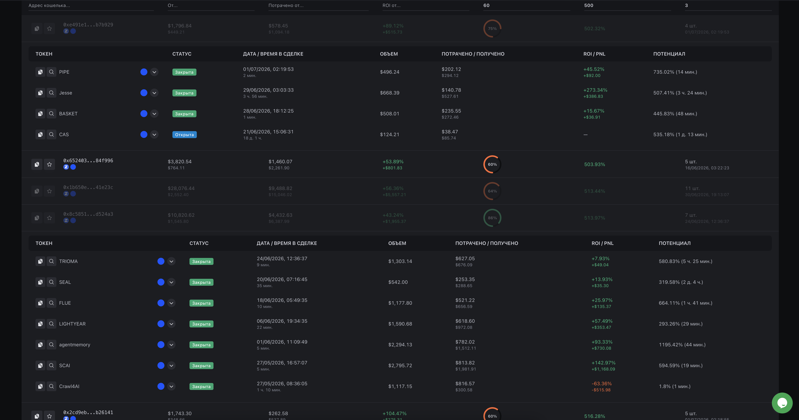
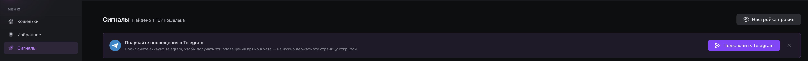
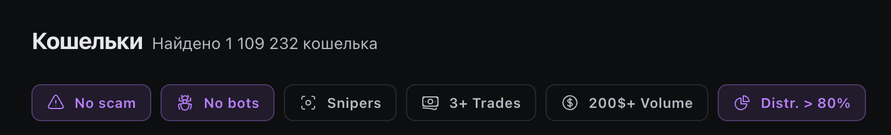
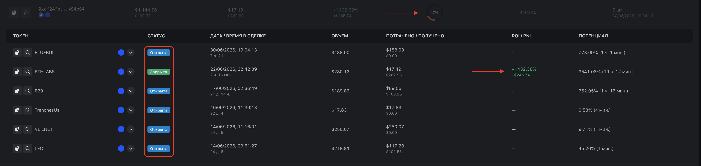
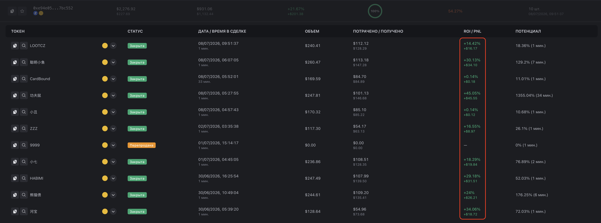

# Как устроен eWalletSpace

Когда вы открываете eWalletSpace, перед вами уже находится готовая база проанализированных кошельков. Это может создавать впечатление, что сервис просто собирает данные из других аналитических платформ.

На самом деле это не так.

Вся аналитика строится на основе собственных расчетов, выполненных по данным блокчейна.

***

### **Источник данных**

eWalletSpace получает информацию напрямую из блокчейна. Мы не импортируем данные из GMGN, DexScreener, Arkham, DEXTools или других сервисов.

Каждый новый токен, каждая сделка и каждый кошелек анализируются собственной системой.

Это позволяет рассчитывать метрики, которых нет в большинстве существующих инструментов, и постоянно поддерживать базу данных в актуальном состоянии.

***

### **Какие сети поддерживаются**

На данный момент eWalletSpace анализирует три сети:

* Ethereum&#x20;
* Base&#x20;
* BNB Smart Chain&#x20;

Все они работают независимо друг от друга, но используют единый механизм анализа. В будущем список поддерживаемых сетей будет расширяться.

***

### **Что анализирует система**

После появления нового токена сервис начинает автоматически анализировать все связанные с ним события.

Это включает:

* покупки;&#x20;
* продажи;&#x20;
* переводы токенов;&#x20;
* историю каждого участвующего кошелька.&#x20;

Другими словами, если кошелек торговал новым токеном, информация о его сделках будет обработана системой.

***

### **Как формируется карточка кошелька**

После обработки транзакций сервис постепенно собирает торговую историю каждого адреса.

Для каждого кошелька рассчитываются основные показатели:

* объем торговли;&#x20;
* количество сделок;&#x20;
* ROI;&#x20;
* PnL;&#x20;
* Win Rate;&#x20;
* средний Потенциал;&#x20;
* среднее время удержания позиции;&#x20;
* другие вспомогательные метрики.&#x20;

В результате пользователь получает не просто адрес, а полноценную карточку трейдера, которую можно анализировать за несколько минут.

<figure><figcaption></figcaption></figure>

***

### **Обновление данных**

Рынок не стоит на месте. Каждый новый блок может изменить статистику кошелька. Поэтому eWalletSpace постоянно обновляет данные.

Когда появляется новая сделка:

* обновляется история трейдера;&#x20;
* пересчитываются его метрики;&#x20;
* при необходимости кошелек становится доступен в поиске;&#x20;
* если он соответствует условиям пользователя, может быть отправлено уведомление через Telegram Alerts.&#x20;

<figure><figcaption></figcaption></figure>

Благодаря этому сервис всегда работает с актуальной информацией.

***

### **Почему в базе есть скам-кошельки**

Это один из самых частых вопросов новых пользователей. Ответ очень простой. Потому что мы анализируем весь рынок. Если кошелек совершает сделки в поддерживаемых сетях, он попадет в базу.

Это касается:

* обычных трейдеров;&#x20;
* новичков;&#x20;
* снайперов;&#x20;
* торговых ботов;&#x20;
* арбитражных кошельков;&#x20;
* мошеннических адресов.&#x20;

Именно поэтому в сервисе предусмотрены фильтры и инструменты сортировки.

<figure><figcaption></figcaption></figure>

***

### **Почему нельзя полностью убрать весь скам**

Иногда пользователи предлагают оставить только «хорошие» кошельки. К сожалению, такой подход не работает.

Во-первых, невозможно автоматически определить качество каждого адреса. Во-вторых, рынок постоянно меняется.

Каждый день появляются новые стратегии торговли, новые боты и новые схемы работы. Если слишком агрессивно фильтровать рынок, вместе со скамом можно потерять действительно интересных трейдеров. Поэтому мы используем другой подход. Мы помогаем сократить объем ручной работы, но не принимаем решение за пользователя.

***

### **Почему окончательное решение всегда остается за пользователем**

Ни одна метрика сама по себе не способна определить качество трейдера. Высокий ROI может оказаться результатом одной удачной сделки.&#x20;

<figure><figcaption></figcaption></figure>

Высокий Win Rate - следствием краткосрочного скальпинга.

<figure><figcaption></figcaption></figure>

Даже высокий Потенциал не гарантирует, что кошелек подойдет именно под вашу стратегию. Именно поэтому eWalletSpace предоставляет инструменты для анализа, а не готовые торговые сигналы.

Лучшие результаты достигаются тогда, когда пользователь сочетает статистику сервиса с собственным анализом графиков, токенов и поведением трейдеров

***

### **Философия продукта**

При разработке eWalletSpace мы придерживались простой идеи. Мы не хотим заменить опыт трейдера. Мы хотим избавить его от самой рутинной части работы. Поиск сильных кошельков должен занимать минуты, а не часы.

Все остальное - оценка проектов, анализ графиков, принятие торговых решений - остается за пользователем.

Именно поэтому eWalletSpace не пытается сказать, какой кошелек "правильный". Он помогает значительно быстрее найти тех, кто заслуживает внимания.

***

### **Что дальше?**

Теперь вы понимаете, как сервис получает данные и почему они устроены именно так.

В следующей главе мы перейдем к практике и покажем, как начать работать с eWalletSpace всего за несколько минут.

Вы узнаете:

* как искать кошельки;&#x20;
* почему поиск через токен эффективнее поиска по всему рынку;&#x20;
* как использовать фильтры;&#x20;
* и как провести первый анализ трейдера.
