# Карточка кошелька

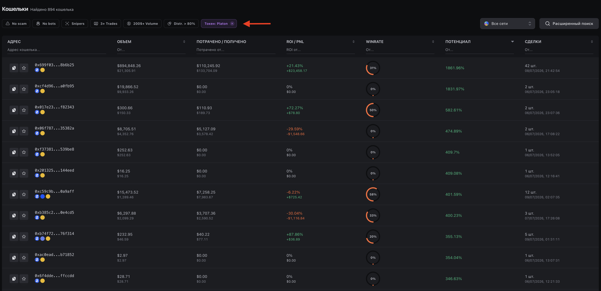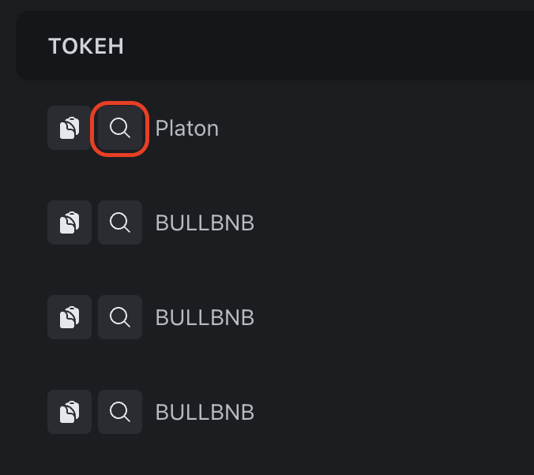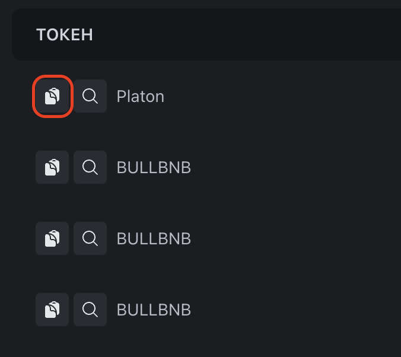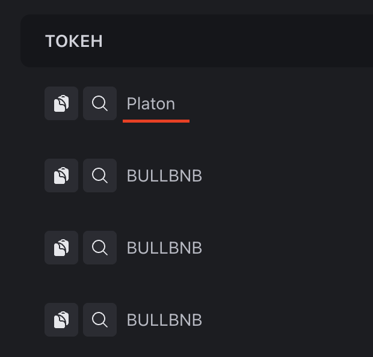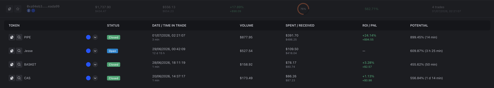Карточка кошелька - основной элемент eWalletSpace. Именно здесь собрана вся информация, необходимая для анализа трейдера.

В верхней части карточки отображается сводная статистика по кошельку, а ниже - полная история его сделок.

<figure>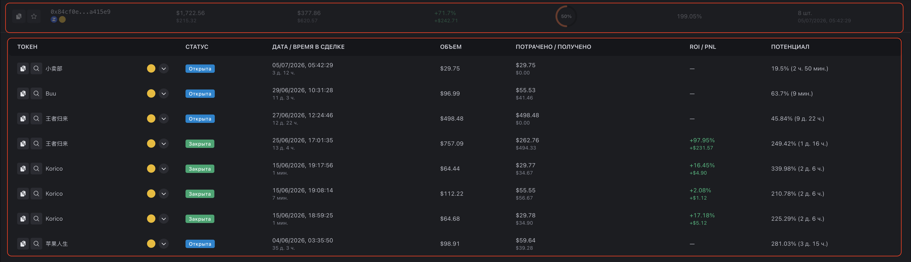<figcaption></figcaption></figure>

В большинстве случаев именно с карточки кошелька начинается принятие решения: стоит ли продолжать анализ, добавить кошелек в избранное или использовать его в своей стратегии.

***

### **Верхняя часть карточки**

В верхней части расположены основные действия и ключевые метрики. Разберем их по порядку.

***

### **Скопировать адрес кошелька**

Первая кнопка позволяет скопировать адрес кошелька.

<figure>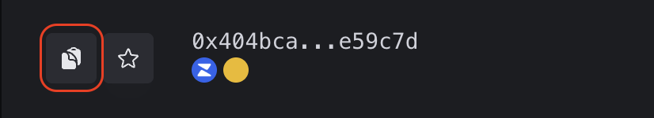<figcaption></figcaption></figure>

Это удобно, если необходимо открыть адрес в стороннем сервисе, отправить его другому пользователю или использовать в торговом боте.

***

### **Избранные**

Иконка ⭐ позволяет добавить кошелек в раздел Избранные.

<figure>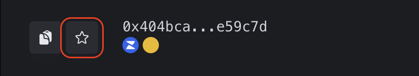<figcaption></figcaption></figure>

Это самый простой способ сохранить интересного трейдера и вернуться к нему позже. В дальнейшем для каждого сохраненного кошелька можно задать собственное название.

<figure>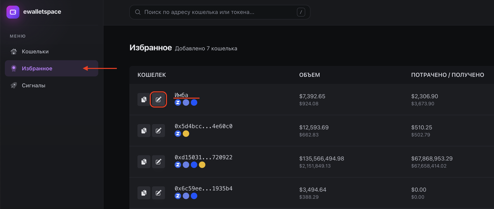<figcaption></figcaption></figure>

***

### **Адрес кошелька**

Рядом отображается сокращенный адрес кошелька.

<figure>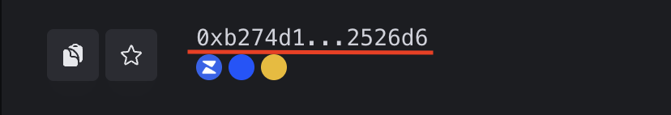<figcaption></figcaption></figure>

Полный адрес всегда можно скопировать одним нажатием.

***

### **Сеть**

Под адресом отображаются сети, в которых работает кошелек.

На данный момент поддерживаются:

* Ethereum&#x20;
* Base&#x20;
* BNB Smart Chain&#x20;

<figure>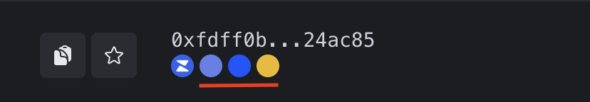<figcaption></figcaption></figure>

Каждая сеть анализируется независимо.

***

### **Zerion**

Рядом находится ссылка на профиль кошелька в Zerion.

<figure>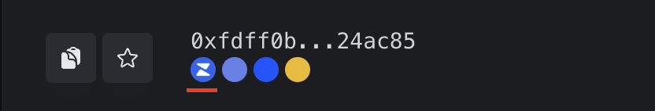<figcaption></figcaption></figure>

Она позволяет быстро перейти во внешний сервис и получить дополнительную информацию о балансе, активах и истории адреса.

***

## **Основные метрики**

После служебной информации отображаются основные показатели торговли.

### **Объём**

<figure>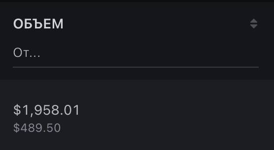<figcaption></figcaption></figure>

Показывает общий объем средств, которыми торговал кошелек за всю анализируемую историю. Эта метрика помогает быстро понять масштаб торговли. Следует учитывать, что большой объем сам по себе не говорит о качестве трейдера.

***

### **Потрачено/получено**

<figure>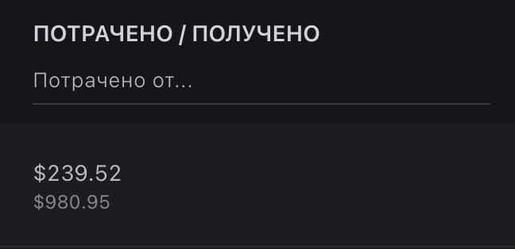<figcaption></figcaption></figure>

Сумма инвестированных и сумма полученных средств по всем сделкам.

***

### **ROI/PnL**

<figure>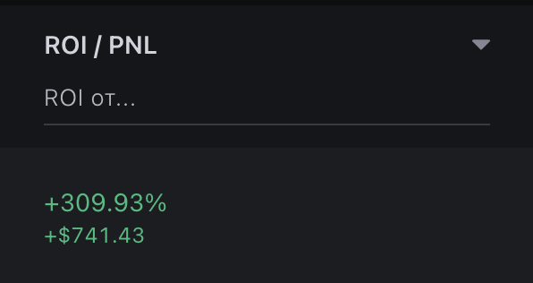<figcaption></figcaption></figure>

**ROI** Показывает среднюю доходность сделок в процентах. Помогает оценить, насколько эффективно трейдер фиксировал прибыль. Однако всегда рекомендуется анализировать его вместе с другими метриками.

**PnL** отображает общий финансовый результат торговли. Показывает абсолютную прибыль или убыток кошелька. В отличие от ROI, этот показатель зависит от объема сделок.

***

### **Win Rate**

<figure>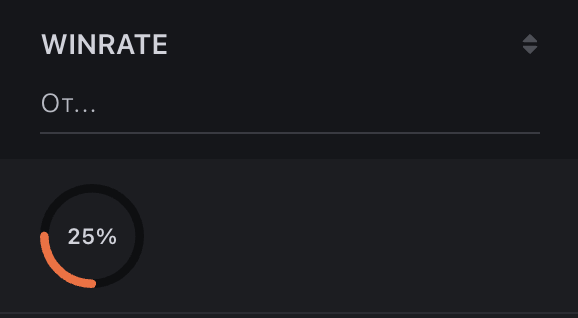<figcaption></figcaption></figure>

Показывает процент прибыльных сделок.

Высокий Win Rate не всегда означает сильного трейдера. Например, некоторые кошельки закрывают большое количество небольших сделок с минимальной прибылью, но не умеют находить действительно сильные проекты. Поэтому Win Rate рекомендуется рассматривать вместе с Потенциал.

***

### **Потенциал**

Потенциал - одна из ключевых метрик eWalletSpace.

<figure>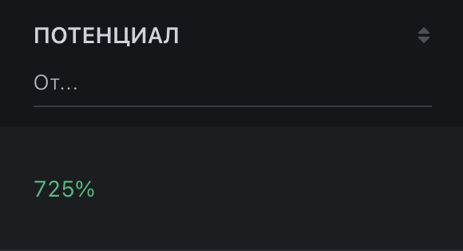<figcaption></figcaption></figure>

Она показывает, насколько выросли токены после точки входа трейдера. Именно эта метрика помогает находить кошельки, которые регулярно входят в перспективные проекты раньше большинства участников рынка.

Подробное описание принципа расчета приведено в разделе **Потенциал**.

***

### **Сделки**

<figure><figcaption></figcaption></figure>

Показывает общее количество сделок, участвующих в расчете статистики. Чем больше сделок, тем выше достоверность выводов о стиле торговли трейдера.

***

### **История сделок**

После раскрытия карточки отображается полный список сделок кошелька.

<figure><figcaption></figcaption></figure>

Каждая строка соответствует одной сделке с конкретным токеном. Именно эта часть карточки используется для детального анализа.

***

### **Информация по каждой сделке**

Для каждой сделки отображается следующий набор данных.

***

### **Токен**

Название токена.

<figure><figcaption></figcaption></figure>

***

### **Скопировать адрес**

Позволяет скопировать адрес смарт-контракта токена.

<figure><figcaption></figcaption></figure>

***

### **Поиск по токену**

Иконка 🔍 открывает этот токен внутри eWalletSpace.

<figure><figcaption></figcaption></figure>

После перехода отображаются все кошельки, которые торговали данным токеном.

<figure><figcaption></figcaption></figure>

Это одна из самых важных функций сервиса.

Именно благодаря ей можно быстро переходить от одного найденного трейдера к новым кошелькам и постепенно расширять собственную базу для анализа.

***

### **Сеть**

Показывает сеть, в которой торговался токен. При нажатии открывается его страница в соответствующем обозревателе блоков.

<figure>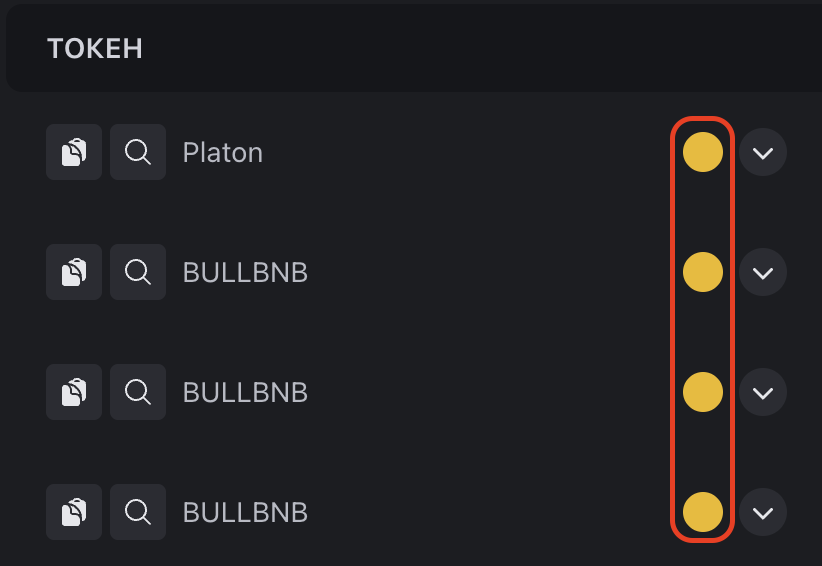<figcaption></figcaption></figure>

***

### **График**

Для каждого токена доступны быстрые ссылки на внешние сервисы.

Например:

* GMGN&#x20;
* DexScreener&#x20;
* DEXTools&#x20;
* Defined&#x20;

<figure>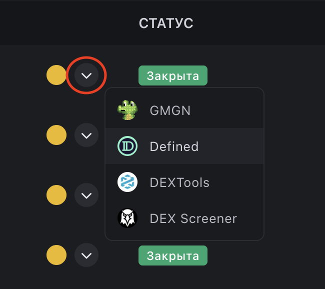<figcaption></figcaption></figure>

Используйте их для просмотра графика и поведения токена после покупки. Мы рекомендуем всегда открывать несколько графиков перед тем, как принимать решение о качестве кошелька.

***

### **Статус**

Показывает текущее состояние сделки.

Например:

**Открыта** - позиция остается открытой.

**Закрыта** - позиция полностью закрыта.

**Перепродана** - токены были куплены и переведены на другой кошелёк, либо получены от другого кошелька и проданы.

<figure>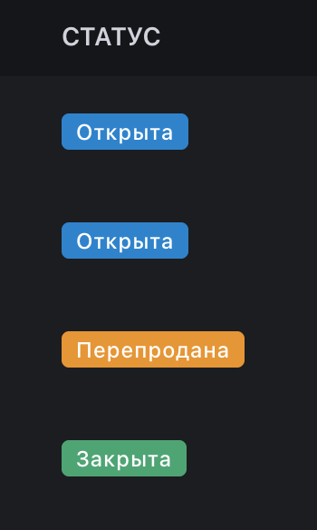<figcaption></figcaption></figure>

***

### **Дата / Время в сделке**

Дата и время первой покупки. Если сделка остается открытой, дополнительно отображается текущее время удержания позиции. Если сделка закрыта, отображается продолжительность удержания токена.

<figure>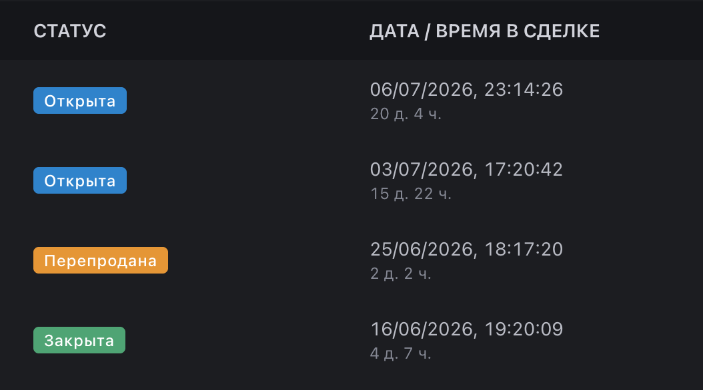<figcaption></figcaption></figure>

***

### **Объём**

Общий объем сделки.

<figure>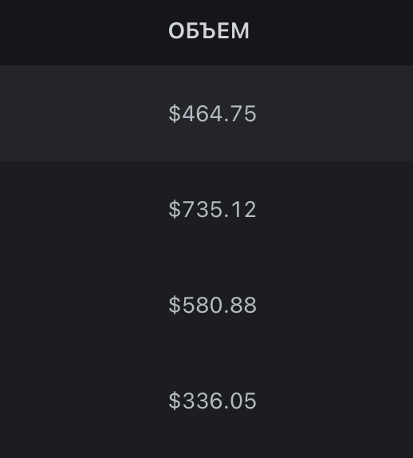<figcaption></figcaption></figure>

***

### **Потрачено / Получено**

Показывает:

* сколько средств было потрачено на покупку;&#x20;
* сколько средств было получено после продажи.&#x20;

<figure>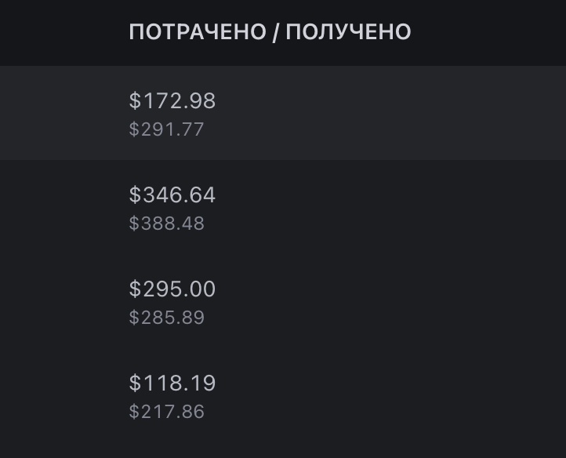<figcaption></figcaption></figure>

***

### **ROI/PnL**

**ROI** - доходность конкретной сделки в процентах. PnL - финансовый результат конкретной сделки в $.

<figure>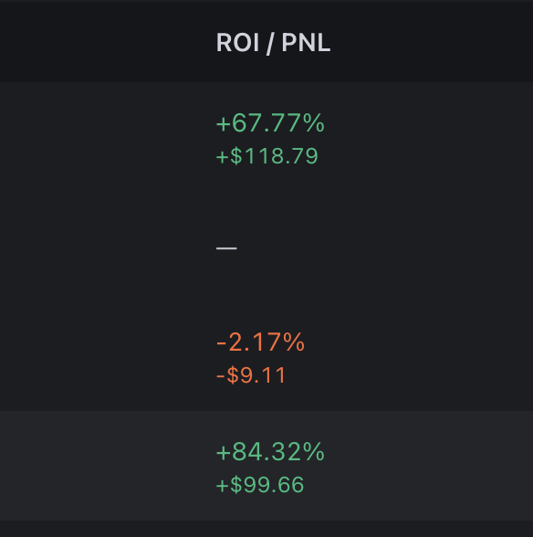<figcaption></figcaption></figure>

***

### **Потенциал**

Потенциал рассчитывается отдельно для каждой сделки.

Рядом дополнительно отображается время, за которое токен достиг своего максимального роста после покупки. Эта информация помогает понять не только величину потенциального роста, но и скорость его достижения.

<figure>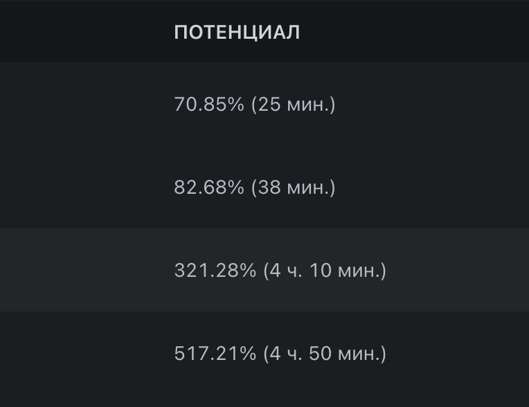<figcaption></figcaption></figure>

***

### **Как использовать карточку кошелька**

Не существует единственно правильного способа анализа.

Однако мы рекомендуем придерживаться следующего порядка.

1. Откройте несколько графиков последних токенов.&#x20;
2. Убедитесь, что история не состоит преимущественно из скам-проектов.&#x20;
3. Посмотрите на Потенциал отдельных сделок.&#x20;
4. Попробуйте найти закономерности.&#x20;
5. Оцените объемы торговли.&#x20;
6. После этого изучите ROI и Win Rate.&#x20;

Такой порядок позволяет значительно быстрее отсеивать неподходящие кошельки.

***

### **Связанные разделы**

После изучения карточки кошелька рекомендуем ознакомиться со следующими страницами документации:

* Карточка сделки&#x20;
* Потенциал&#x20;
* Избранные&#x20;
* Оповещения в Telegram&#x20;
* Расширенный поиск

 
