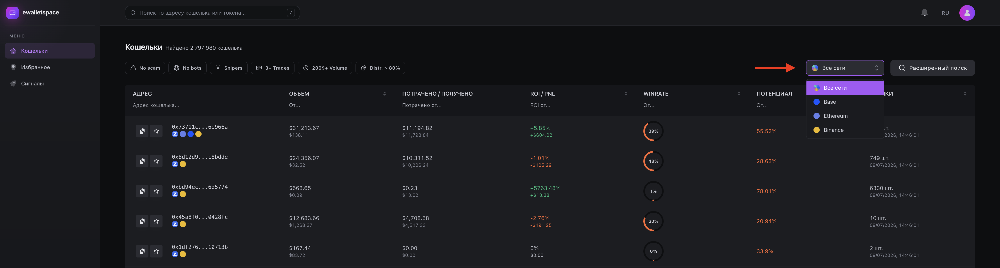
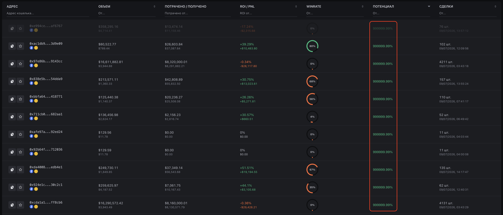
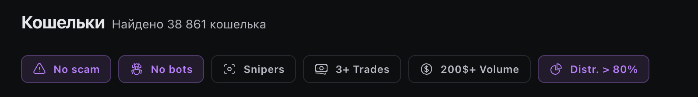
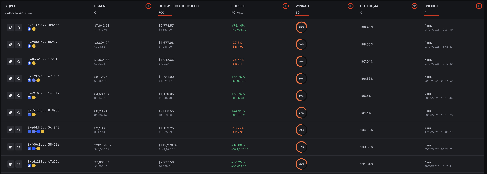

# Поиск по всему рынку

Самый простой способ начать работу - использовать поиск без указания конкретного токена. В этом режиме eWalletSpace анализирует всю доступную базу кошельков выбранной сети.

<figure><figcaption></figcaption></figure>

Такой способ позволяет находить интересных трейдеров даже без привязки к определенному проекту. Однако важно понимать его особенности.

***

### **Особенности глобального поиска**

Поскольку сервис анализирует весь рынок, в результаты поиска попадают абсолютно разные типы кошельков.

Например:

* обычные трейдеры;&#x20;
* новые кошельки;&#x20;
* снайперы;&#x20;
* торговые боты;&#x20;
* арбитражные кошельки;&#x20;
* мошеннические адреса.&#x20;

Из-за этого самые верхние позиции при сортировке по ROI или Потенциалу далеко не всегда оказываются самыми интересными. Очень часто именно скам-кошельки демонстрируют экстремально высокие показатели.

<figure><figcaption></figcaption></figure>

Поэтому поиск по всему рынку рекомендуется использовать только как дополнительный инструмент.

***

### **Быстрые фильтры**

Над списком кошельков расположены быстрые фильтры.

<figure><figcaption></figcaption></figure>

Они позволяют быстро изменить выдачу без использования расширенного поиска.

В зависимости от выбранных фильтров можно:

* скрыть часть очевидных ботов;&#x20;
* исключить часть снайперов;&#x20;
* оставить только кошельки с несколькими сделками;&#x20;
* исключить кошельки, торговавшие только одним токеном.&#x20;

Следует понимать, что эти фильтры не являются абсолютными. Они помогают сократить объем ручной работы, но не гарантируют полное отсутствие нежелательных кошельков.

***

### **Сортировка**

После применения фильтров можно отсортировать список практически по любой метрике.

Например:

* Потенциал;&#x20;
* ROI;&#x20;
* PnL;&#x20;
* Win Rate;&#x20;
* количеству сделок;&#x20;
* объему торговли.&#x20;

Каждая колонка поддерживает сортировку по возрастанию и убыванию, и возможность вручную прописать нужное числовое значение для лучшей фильтрации.

<figure><figcaption></figcaption></figure>

Наиболее популярным вариантом является сортировка по Потенциалу, поскольку именно она быстрее всего помогает находить кошельки с качественными входами.

***

### **Расширенный поиск**

В системе существует возможность применения тонкой фильтрации через расширенный поиск. Например, задать максимальное количество сделок по кошельку, или ограничить максимальный Потенциал, чтобы убрать из списка очевидный скам.

Благодаря данной функции вы можете максимально точно подбирать кошельки под разные стратегии торговли.

***

### **P.S.**

Задача eWalletSpace - максимально быстро сузить поиск и предоставить инструменты для анализа и выбора трейдеров для копирования их сделок.

Окончательное решение по выбору кошельков всегда остается за вами.

\
 

 

\
 

 
