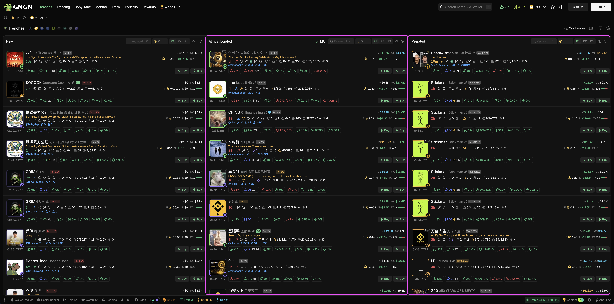
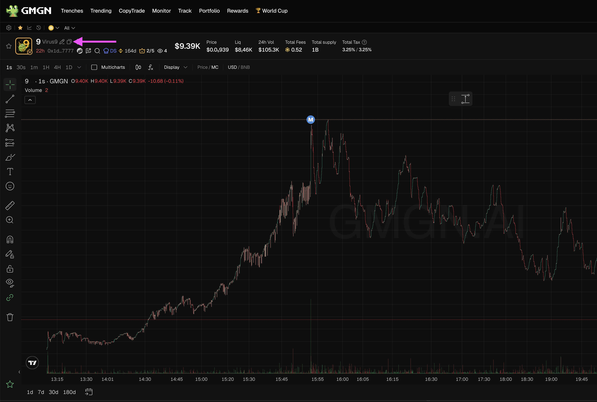
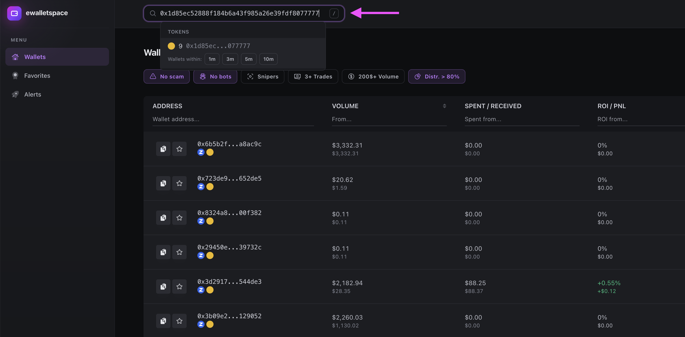
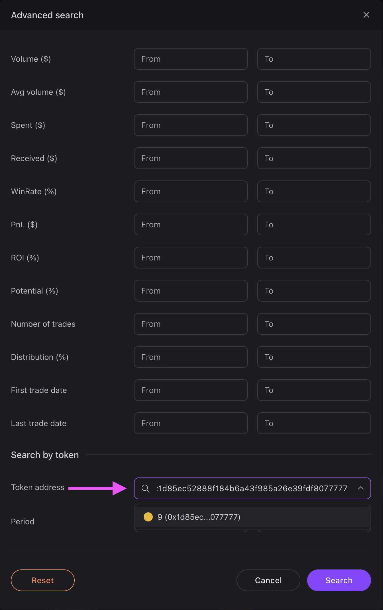
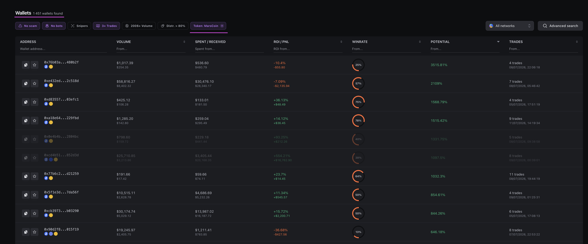
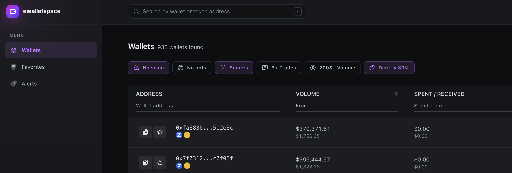
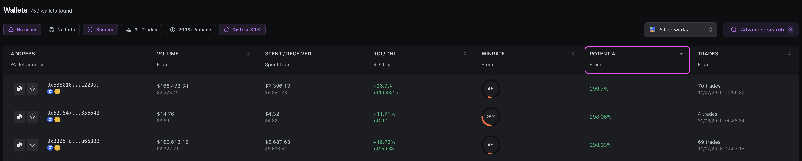
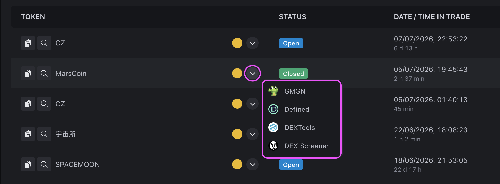
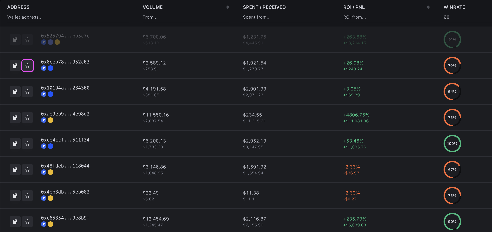
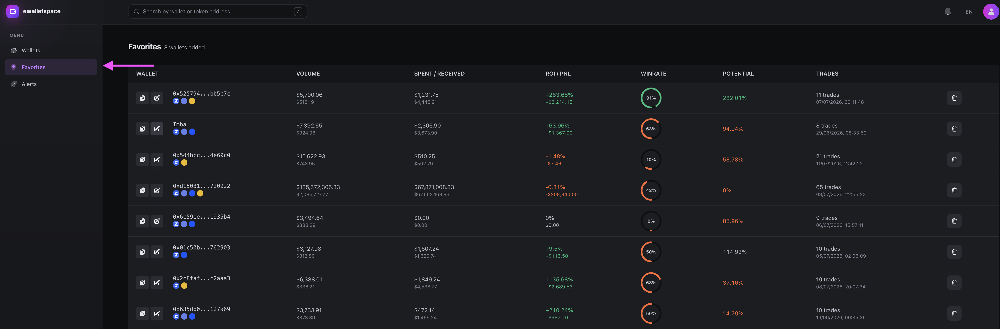

# Quick Start

Now that you're familiar with the capabilities of eWalletSpace, it's time to perform your first search.

The platform can be used in different ways. However, in practice, there is one workflow that consistently delivers the best results. This is the workflow we recommend starting with.

### Step 1. Find an Interesting Token

Before getting started, choose the token you want to analyze.

The source can be any service you normally use.

For example:

* GMGN;
* DexScreener;
* DEXTools;
* Launchpad platforms;
* Telegram channels;
* Recommendations from other traders.

Most often, we use tokens that have already completed their Launchpad migration or are close to reaching that stage.

<figure><figcaption></figcaption></figure>

#### Why These Tokens?

Because by that point, it becomes clear that the developer has fulfilled at least part of their commitments to the market. The probability of finding quality traders on such tokens is much higher than on random launches that were abandoned just a few minutes after launch.

This is not a rule, but a practical observation that helps save time.

### Step 2. Open the Token in eWalletSpace

Once you have found an interesting token, copy its smart contract address.

<figure><figcaption></figcaption></figure>

There are two ways to open it in eWalletSpace. The first method is to paste the address into the quick search bar at the top of the interface.

<figure><figcaption></figcaption></figure>

The second method is to use the advanced search and enter the token address into the appropriate field.

<figure><figcaption></figcaption></figure>

In both cases, the result will be the same. The platform will display all wallets that have traded this token.

<figure><figcaption></figcaption></figure>

***

### Step 3. Use Quick Filters

Before starting your analysis, we recommend using the quick filters.

For example, you can:

* Exclude some obvious scam wallets;
* Hide some trading bots;
* Show only wallets with multiple trades;
* View only snipers.

<figure><figcaption></figcaption></figure>

There is no universal set of filters. Over time, every user develops their own preferred combination. Don't be afraid to experiment.

### Step 4. Sort the List

After applying filters, the most interesting part begins. We recommend starting by sorting the list by **Potential**.

<figure><figcaption></figcaption></figure>

#### Why Potential?

Because this metric allows you to find wallets that consistently enter promising projects before the rest of the market as quickly as possible.

A high ROI does not necessarily mean that a trader is good at finding new tokens.

A high Potential often does.

After sorting, open the first few wallets and begin analyzing them.

***

### Step 5. Review the Wallet Profile

Don't rush to look at the impressive numbers. The first thing we recommend is opening several tokens that this wallet has traded.

<figure><figcaption></figcaption></figure>

Look at the charts.

Try to understand:

* Whether these were legitimate projects;
* Whether the developer supported the token;
* Whether the liquidity was removed immediately after launch;
* Whether the wallet's history mainly consists of scam projects.

If it is already clear at this stage that most of the trades are associated with obvious low-quality projects, there is no point in continuing the analysis. It is better to move on to the next wallet immediately. This approach saves a significant amount of time.

***

### Step 6. Analyze the Metrics

If the token history looks solid, move on to analyzing the statistics.

Pay attention to:

* Average Potential;
* Trading Volume;
* Trading frequency;
* ROI;
* Win Rate.

Don't try to find the perfect wallet.

It is much more important to understand whether there is a consistent pattern in the trader's activity.

For example, some traders regularly find tokens that later grow by thousands of percent.

Even if some of their trades end in losses, that kind of consistency can be far more valuable than a high Win Rate.

***

### Step 7. Save Interesting Wallets

If a wallet looks promising, add it to **Favorites**.

<figure><figcaption></figcaption></figure>

Over time, you will build your own database of traders that you can return to regularly and monitor their new trades.

<figure><figcaption></figcaption></figure>

Don't try to find one perfect trader immediately. It is much more effective to gradually build a small collection of wallets with different trading styles.

***

### What's Next?

Once you have mastered the basic search workflow, you can move on to exploring the platform's advanced features.

In the following sections of the documentation, we will take a detailed look at:

* The wallet profile;
* The trade details page;
* All trading metrics;
* Advanced Search;
* Favorites;
* Telegram Alerts;
* Presets;
* And the rest of the eWalletSpace features.

\
 
