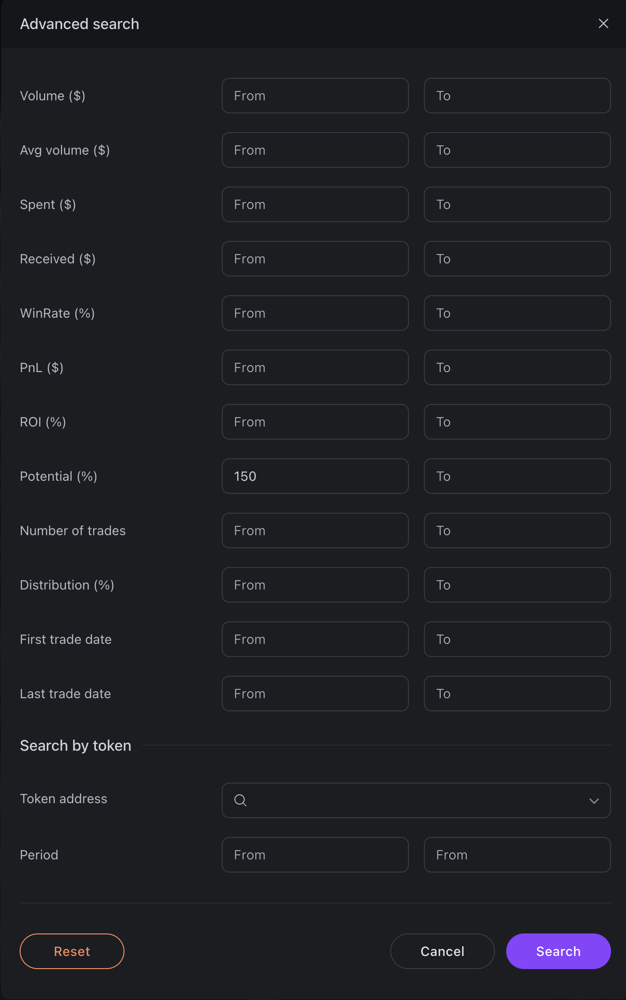

# Search Across the Entire Market

The simplest way to get started is to use the search without specifying a particular token.

In this mode, eWalletSpace analyzes the entire available database of wallets on the selected network.

<figure><figcaption></figcaption></figure>

This approach allows you to discover interesting traders without being tied to a specific project. However, it is important to understand how this search works.

***

#### **Features of Global Search**

Since the platform analyzes the entire market, the search results include many different types of wallets.

For example:

* Regular traders;
* New wallets;
* Snipers;
* Trading bots;
* Arbitrage wallets;
* Scam addresses.

Because of this, the wallets at the top of the list when sorting by ROI or Potential are not always the most interesting ones.

Very often, scam wallets demonstrate extremely high metrics.

<figure><figcaption></figcaption></figure>

For this reason, searching across the entire market is recommended only as an additional tool.

***

#### **Quick Filters**

Quick filters are located above the wallet list.

<figure><figcaption></figcaption></figure>

They allow you to quickly refine the results without using Advanced Search.

Depending on the selected filters, you can:

* Hide some obvious bots;
* Exclude some snipers;
* Show only wallets with multiple trades;
* Exclude wallets that have traded only one token.

It is important to understand that these filters are not absolute. They help reduce the amount of manual work but do not guarantee the complete removal of unwanted wallets.

***

#### **Sorting**

After applying filters, you can sort the list by almost any metric.

For example:

* Potential;
* ROI;
* PnL;
* Win Rate;
* Number of Trades;
* Trading Volume.

Each column supports both ascending and descending sorting, as well as the ability to manually enter the desired numeric value for more precise filtering.

<figure><figcaption></figcaption></figure>

The most popular option is sorting by Potential, as it is the fastest way to identify wallets with high-quality entries.

***

### Advanced Search

The platform also provides advanced filtering through Advanced Search.

For example, you can set the maximum number of trades for a wallet or limit the maximum Potential value to remove obvious scam wallets from the results.

This feature allows you to select wallets as precisely as possible for different trading strategies.

<figure><figcaption></figcaption></figure>

***

### P.S.

The goal of eWalletSpace is to narrow your search as quickly as possible and provide the tools needed to analyze traders and select wallets for copy trading.

The final decision about which wallets to follow or copy is always yours.

 
