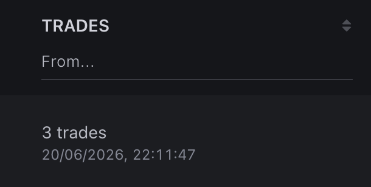

# Wallet Profile

The wallet profile is the main element of eWalletSpace. It contains all the information needed to analyze a trader.

At the top of the profile, you will find a summary of the wallet's statistics. Below it is the complete trading history.

<figure><figcaption></figcaption></figure>

\
In most cases, the wallet profile is where the decision is made whether to continue the analysis, add the wallet to Favorites, or use it in your trading strategy.

***

### Top Section of the Profile

The top section contains the main actions and key trading metrics. Let's go through them one by one.

***

**Copy Wallet Address**

The first button allows you to copy the **wallet address**.

<figure><figcaption></figcaption></figure>

This is useful if you want to open the address in another service, send it to another user, or use it in a trading bot.

***

**Favorites**

The ⭐ icon allows you to add the wallet to **Favorites**.

<figure><figcaption></figcaption></figure>

This is the easiest way to save an interesting trader and return to it later. You can also assign a custom name to every saved wallet.

<figure><figcaption></figcaption></figure>

***

#### Wallet Address

Next to it, the shortened wallet address is displayed.

<figure><figcaption></figcaption></figure>

The full address can always be copied with a single click.

***

#### Network

Below the address, the networks in which the wallet operates are displayed.

Currently supported:

* Ethereum
* Base
* BNB Smart Chain

<figure><figcaption></figcaption></figure>

Each network is analyzed independently.

***

#### **Zerion**

Next to it is a link to the wallet's profile on Zerion.

<figure><figcaption></figcaption></figure>

It allows you to quickly open an external service and view additional information about the wallet balance, assets, and address history.

***

#### **Main Metrics**

After the service information, the main trading metrics are displayed.

***

#### Volume

\
 

Shows the total trading volume of the wallet across the entire analyzed history. This metric helps you quickly understand the scale of the trader's activity. Keep in mind that a high trading volume alone does not indicate a high-quality trader.

***

#### **Spent / Received**

<figure><figcaption></figcaption></figure>

Shows the total amount invested and the total amount received across all trades.

***

#### **ROI / PnL**

<figure><figcaption></figcaption></figure>

**ROI** shows the average return on trades as a percentage. It helps evaluate how effectively the trader realized profits. However, it is always recommended to analyze it together with other metrics.

**PnL** shows the overall financial result of the trader. It displays the wallet's total profit or loss. Unlike ROI, this metric depends on trading volume.

***

#### **Win Rate**

<figure><figcaption></figcaption></figure>

Shows the percentage of profitable trades. A high Win Rate does not always indicate a strong trader.

For example, some wallets close a large number of small trades with minimal profit but are unable to identify truly strong projects. Therefore, Win Rate should be evaluated together with **Potential**.

***

#### **Potential**

Potential is one of the key metrics in eWalletSpace.

<figure><figcaption></figcaption></figure>

It shows how much a token increased in value after the trader entered the position. This metric helps identify wallets that consistently enter promising projects before most market participants.

A detailed explanation of the calculation method is provided in the Potential section.

***

#### **Trades**

<figure><figcaption></figcaption></figure>

Shows the total number of trades included in the statistical calculations. The more trades a wallet has, the more reliable the conclusions about the trader's trading style.

***

#### Trade History

After opening the wallet profile, the complete list of the wallet's trades is displayed.

<figure><figcaption></figcaption></figure>

Each row represents one trade for a specific token. This is the part of the profile used for detailed analysis.

***

### Information Displayed for Each Trade

The following information is shown for every trade.

***

#### Token

The token name.

<figure><figcaption></figcaption></figure>

***

#### Copy Address

Allows you to copy the token's smart contract address.

<figure><figcaption></figcaption></figure>

***

#### Token Search

The 🔍 icon opens this token inside eWalletSpace.

<figure><figcaption></figcaption></figure>

After opening it, you will see all wallets that have traded this token.

<figure><figcaption></figcaption></figure>

This is one of the most important features of the platform.

It allows you to quickly move from one discovered trader to new wallets and gradually expand your own database for analysis.&#x20;

***

#### Network

Shows the network in which the token was traded. Clicking it opens the token page in the corresponding blockchain explorer.

<figure><figcaption></figcaption></figure>

***

#### Chart

Quick links to external services are available for every token.

For example:

* GMGN
* DexScreener
* DEXTools
* Defined

<figure><figcaption></figcaption></figure>

Use these services to view the chart and analyze the token's behavior after the purchase. We recommend always opening several charts before deciding whether a wallet is worth following.

***

#### Status

Shows the current status of the trade.

For example:

* **Open** - the position is still open.
* **Closed** - the position has been fully closed.
* **Oversold** - the tokens were purchased and transferred to another wallet, or received from another wallet and then sold.

<figure><figcaption></figcaption></figure>

***

#### Date / Time in Trade

Shows the date and time of the first purchase. If the trade is still open, the current holding time is also displayed. If the trade has been closed, the total holding time is displayed.

<figure><figcaption></figcaption></figure>

***

#### Volume

Shows the total volume of the trade.

<figure><figcaption></figcaption></figure>

***

#### Spent / Received

Shows:

* How much was spent to purchase the token;
* How much was received after selling it.

<figure><figcaption></figcaption></figure>

***

#### ROI / PnL

**ROI** is the return of the individual trade expressed as a percentage.

**PnL** is the financial result of the individual trade in USD.

<figure><figcaption></figcaption></figure>

***

#### Potential

Potential is calculated separately for every trade.

Next to it, the time it took for the token to reach its maximum growth after the purchase is also displayed.

This information helps you understand not only the size of the potential growth but also how quickly it was achieved.

<figure><figcaption></figcaption></figure>

***

### How to Use the Wallet Profile

There is no single correct way to analyze a wallet.

However, we recommend following this order:

* Open the charts for several recent tokens.
* Make sure the trading history does not consist mainly of scam projects.
* Review the Potential of individual trades.
* Look for recurring patterns.
* Evaluate the trading volume.
* Then review ROI and Win Rate.

This approach allows you to filter out unsuitable wallets much more quickly.

***

### Related Sections

After reviewing the wallet profile, we recommend reading the following documentation pages:

* Trade Profile
* Potential
* Favorites
* Telegram Alerts
* Advanced Search

 
